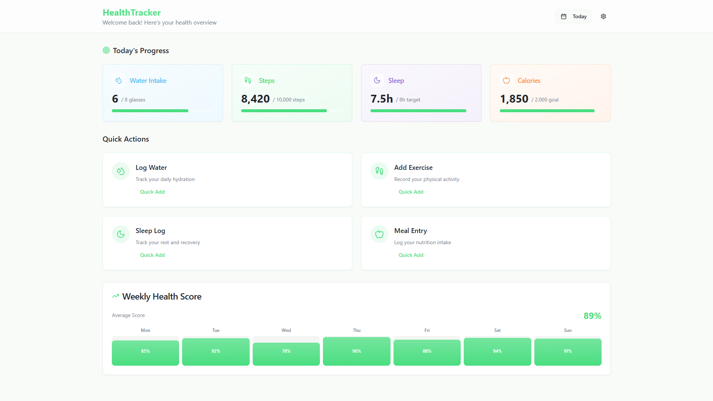

# HealthTracker

HealthTracker helps users efficiently track their health and wellness habits.  
It focuses on essential health tracking features with a **modern React 18 + TypeScript frontend** styled using **Tailwind CSS**.  
The system ensures a **clean, intuitive, and responsive UI/UX**.

---

## ✨ Features  

### 📊 Dashboard Overview  
- **Water Intake** – Track daily hydration progress.  
- **Steps** – Monitor activity (daily step goal).  
- **Sleep** – Log sleep duration and track against targets.  
- **Calories** – Track daily calorie consumption vs. goal.  

### ⚡ Quick Actions  
- **Log Water** – Quick hydration logging.  
- **Sleep Log** – Easy rest and recovery tracking.  
- **Add Exercise** – Record physical activities.  
- **Meal Entry** – Log meals and nutrition intake.  

### 📈 Weekly Health Score  
- Visual breakdown of daily health scores.  
- Average health score displayed for the week.  

📂 File

[Health Tracker(PDF)](./Hea;th%20Tracker.pdf)

# Web Preview

